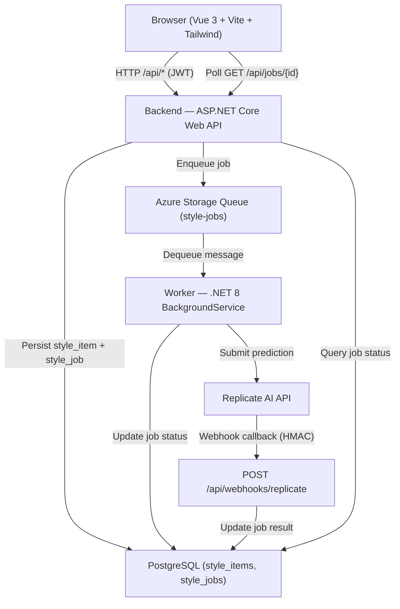

# Architecture

## System Overview

## Components

### Frontend (`/frontend`)
- **Vue 3 + Vite** SPA served on `http://localhost:5173` in development.
- **Tailwind CSS 4** via `@tailwindcss/vite` plugin (v4 `@import "tailwindcss"` syntax).
- **Pinia** stores: `auth`, `style`, `job`.
- `auth` store: Dev login via `POST /api/auth/token`, persists JWT to `localStorage`.
- **Top auth bar + account route**: persistent header actions expose `Dev Login`, `Account`, and `Logout`, and `/account` shows the current session state plus shortcuts back to generation and job history.
- `style` store: CRUD + `generate()` which enqueues a job and starts polling.
- `job` store: Polls `GET /api/jobs/{id}` with exponential backoff (2 s → 10 s cap) until terminal.
- **Jobs page** (`JobsPage`): authenticated job history powered by `GET /api/jobs`, with inline `PUT /api/jobs/{id}/visibility` toggles for public/private result sharing.
- Calls the backend via `fetch` proxied through Vite dev server (`/api → localhost:5000`).
- **Public feed** (`HomePage`): anonymous infinite-scroll grid of public results using cursor-based pagination (`GET /api/style/feed?take=12&before=<ISO>`). The feed uses an `IntersectionObserver` sentinel to load the next page automatically as the user scrolls.
- **`useBackendRequestState` composable**: shared loading/error/offline state across all data-fetching pages. Detects network failures (`statusCode: 0`) and schedules automatic retries for read operations. Submit flows use `handleError` without a retry function so errors surface immediately without re-submitting.

### Backend (`/backend`)
- **ASP.NET Core Web API** on `http://localhost:5000` / `https://localhost:5001` in development.
- Validates JWT on protected routes.
- Persists style items and job records to PostgreSQL via EF Core 8.
- Enqueues `StyleJob` messages to Azure Storage Queue.
- Accepts image uploads via `POST /api/upload/image` and exposes `GET /api/upload/public/{userId}/{fileName}` for external model fetches.
- Receives Replicate webhook callbacks (`POST /api/webhooks/replicate`), verifies HMAC-SHA256 signature, updates job status and result in the database, and can enqueue a follow-up beard stage for multi-step jobs.
- On the final successful webhook callback, archives the generated image to blob storage and stores a permanent `result_image_url`.
- Exposes Swagger at `/swagger` in development.
- Auto-applies EF Core migrations on startup in Development.

### Worker (`/worker`)
- **BackgroundService** that polls the Azure Storage Queue every 5 seconds.
- Deserializes each message as a `StyleJob` (from `AiStyleApp.Data.Queue` shared library).
- Marks the job `Processing` in PostgreSQL, validates/normalizes image + haircut/color/beard inputs, submits a prediction to the Replicate API, stores the returned `external_prediction_id`.
- Retries up to 3 times on Replicate API failure; marks `Failed` on exhaustion.
- Deletes the message from the queue only after successful processing.
- Uses `flux-kontext-apps/change-haircut` for hair edits and a separately configured beard-edit model for beard stages, resolving `latest_version.id` dynamically from Replicate.

### Shared Data Library (`/data`)
- **`AiStyleApp.Data`** class library referenced by both Backend and Worker.
- Contains EF Core entities (`StyleItemEntity`, `StyleJobEntity`), `AppDbContext`, and the `StyleJob` queue message contract.
- EF Core migrations live here.

### Infrastructure (`/infrastructure`)
- Azure Storage Queue: `style-jobs`
- PostgreSQL: `ai_style_app` database with `style_items` and `style_jobs` tables
- Local emulation: Azurite (queue), PostgreSQL running on port 5432

## Unit Testing Footprint

- Backend unit tests use xUnit in `tests/AiStyleApp.Tests` with EF Core InMemory for service-level validation.
- Frontend unit tests use Vitest with `src/**/*.test.ts` discovery.
- Current test files:
  - `tests/AiStyleApp.Tests/JobServiceTests.cs` — job enqueue and queue message contracts
  - `tests/AiStyleApp.Tests/AuthControllerTests.cs` — JWT token generation and expiration clamping
  - `tests/AiStyleApp.Tests/StyleServiceTests.cs` — style generation service coverage (currently stale: still references removed beard fields)
  - `frontend/src/types/api.test.ts` — API type shape validation

## Database Schema

### `style_items`

| Column | Type | Notes |
|---|---|---|
| `id` | uuid | PK |
| `user_id` | varchar(128) | indexed |
| `name` | varchar(200) | |
| `description` | varchar(2000) | |
| `prompt` | varchar(4000) | |
| `image_url` | varchar(2048) | uploaded user photo URL |
| `is_result_public` | boolean | if true, generated result can be shown via shared link |
| `created_at_utc` | timestamptz | |
| `updated_at_utc` | timestamptz | |

### `style_jobs`

| Column | Type | Notes |
|---|---|---|
| `id` | uuid | PK |
| `style_item_id` | uuid | FK → style_items, cascade delete |
| `user_id` | varchar(128) | indexed |
| `job_type` | varchar(100) | |
| `status` | varchar(50) | indexed; default `Queued` |
| `prompt` | varchar(4000) | |
| `image_url` | varchar(2048) | source user image URL |
| `haircut` | varchar(200) | normalized haircut selection |
| `hair_color` | varchar(200) | normalized hair color selection |
| `beard_style` | varchar(200) | optional beard selection |
| `beard_color` | varchar(200) | optional beard color selection |
| `gender` | varchar(50) | used for beard eligibility |
| `pipeline_mode` | varchar(50) | `HairOnly`, `BeardOnly`, or `HairThenBeard` |
| `current_stage` | varchar(50) | current stage: `Queued`, `Hair`, or `Beard` |
| `is_beard_stage_pending` | boolean | whether a successful hair stage should enqueue beard processing |
| `intermediate_image_url` | varchar(2048) | temporary hair-stage output reused by the beard stage |
| `external_prediction_id` | varchar(200) | active Replicate prediction ID for the current stage |
| `result_json` | jsonb | null until Succeeded |
| `result_image_url` | varchar(2048) | permanent archived blob URL for generated image |
| `error_code` | varchar(100) | |
| `error_message` | varchar(2000) | |
| `attempt_count` | int | |
| `max_attempts` | int | default 3 |
| `correlation_id` | varchar(100) | |
| `created_at_utc` | timestamptz | |
| `started_at_utc` | timestamptz | |
| `completed_at_utc` | timestamptz | |

## Data Flow

1. User uploads a photo (`POST /api/upload/image`) and fills out Generate Style fields (Name, Description, optional prompt, haircut, hair color, gender, visibility).
2. Frontend calls `POST /api/style/generate` with a JWT and the uploaded `imageUrl`.
3. Backend creates a `StyleItemEntity` and `StyleJobEntity` (status `Queued`) in PostgreSQL, then enqueues a `StyleJob` message including image and hair parameters.
4. Backend returns `202 Accepted` with `jobId` and `statusEndpoint`.
5. Frontend navigates to the job status page and begins polling `GET /api/jobs/{id}`.
6. Worker dequeues the message, marks the job `Processing`, verifies the image is externally reachable, and submits a prediction to Replicate (`flux-kontext-apps/change-haircut`).
7. Replicate sends a webhook callback to `POST /api/webhooks/replicate`.
8. Backend verifies the HMAC signature, updates the job to `Succeeded` (or `Failed`) with `result_json`, and asynchronously archives the generated image.
9. Frontend polling detects the terminal status and displays the result (or error).

