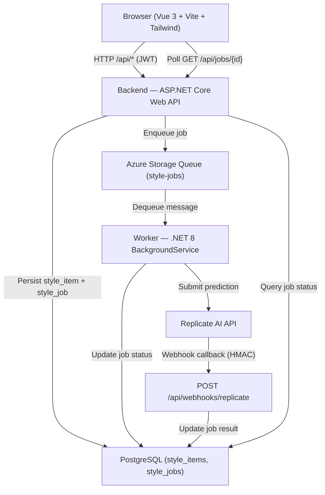

# Architecture

## System Overview

## Components

### Frontend (`/frontend`)
- **Vue 3 + Vite** SPA served on `http://localhost:5173` in development.
- **Tailwind CSS 4** via `@tailwindcss/vite` plugin (v4 `@import "tailwindcss"` syntax).
- **Pinia** stores: `auth`, `style`, `job`.
- `auth` store: Dev login via `POST /api/auth/token`, persists JWT to `localStorage`.
- `style` store: CRUD + `generate()` which enqueues a job and starts polling.
- `job` store: Polls `GET /api/jobs/{id}` with exponential backoff (2 s → 10 s cap) until terminal.
- Calls the backend via `fetch` proxied through Vite dev server (`/api → localhost:5000`).

### Backend (`/backend`)
- **ASP.NET Core Web API** on `http://localhost:5000` / `https://localhost:5001` in development.
- Validates JWT on protected routes.
- Persists style items and job records to PostgreSQL via EF Core 8.
- Enqueues `StyleJob` messages to Azure Storage Queue.
- Receives Replicate webhook callbacks (`POST /api/webhooks/replicate`), verifies HMAC-SHA256 signature, updates job status and result in the database.
- Exposes Swagger at `/swagger` in development.
- Auto-applies EF Core migrations on startup in Development.

### Worker (`/worker`)
- **BackgroundService** that polls the Azure Storage Queue every 5 seconds.
- Deserializes each message as a `StyleJob` (from `AiStyleApp.Data.Queue` shared library).
- Marks the job `Processing` in PostgreSQL, submits a prediction to the Replicate API, stores the returned `external_prediction_id`.
- Retries up to 3 times on Replicate API failure; marks `Failed` on exhaustion.
- Deletes the message from the queue only after successful processing.

### Shared Data Library (`/data`)
- **`AiStyleApp.Data`** class library referenced by both Backend and Worker.
- Contains EF Core entities (`StyleItemEntity`, `StyleJobEntity`), `AppDbContext`, and the `StyleJob` queue message contract.
- EF Core migrations live here.

### Infrastructure (`/infrastructure`)
- Azure Storage Queue: `style-jobs`
- PostgreSQL: `ai_style_app` database with `style_items` and `style_jobs` tables
- Local emulation: Azurite (queue), PostgreSQL running on port 5432

## Database Schema

### `style_items`

| Column | Type | Notes |
|---|---|---|
| `id` | uuid | PK |
| `user_id` | varchar(128) | indexed |
| `name` | varchar(200) | |
| `description` | varchar(2000) | |
| `prompt` | varchar(4000) | |
| `created_at_utc` | timestamptz | |
| `updated_at_utc` | timestamptz | |

### `style_jobs`

| Column | Type | Notes |
|---|---|---|
| `id` | uuid | PK |
| `style_item_id` | uuid | FK → style_items, cascade delete |
| `user_id` | varchar(128) | indexed |
| `job_type` | varchar(100) | |
| `status` | varchar(50) | indexed; default `Queued` |
| `prompt` | varchar(4000) | |
| `external_prediction_id` | varchar(200) | Replicate prediction ID |
| `result_json` | jsonb | null until Succeeded |
| `error_code` | varchar(100) | |
| `error_message` | varchar(2000) | |
| `attempt_count` | int | |
| `max_attempts` | int | default 3 |
| `correlation_id` | varchar(100) | |
| `created_at_utc` | timestamptz | |
| `started_at_utc` | timestamptz | |
| `completed_at_utc` | timestamptz | |

## Data Flow

1. User fills out the Generate Style form (Name, Description, Prompt) in the Vue frontend.
2. Frontend calls `POST /api/style/generate` with a JWT.
3. Backend creates a `StyleItemEntity` and `StyleJobEntity` (status `Queued`) in PostgreSQL, then enqueues a `StyleJob` message.
4. Backend returns `202 Accepted` with `jobId` and `statusEndpoint`.
5. Frontend navigates to the job status page and begins polling `GET /api/jobs/{id}`.
6. Worker dequeues the message, marks the job `Processing`, and submits a prediction to the Replicate API.
7. Replicate sends a webhook callback to `POST /api/webhooks/replicate`.
8. Backend verifies the HMAC signature, updates the job to `Succeeded` (or `Failed`) with `result_json`.
9. Frontend polling detects the terminal status and displays the result (or error).

