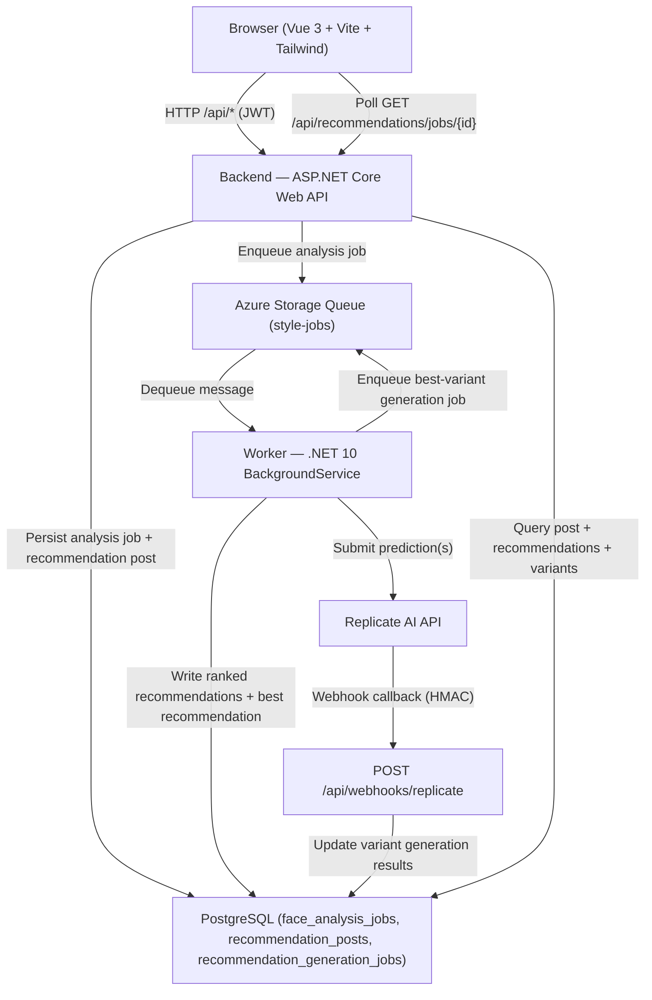

# Architecture

## System Overview

Product direction (2026-07): the app is recommendations-first. Canonical flow is upload -> analyze -> publish post -> generate 1 best variant based on telemetry and mapping logic. Pre-MVP, experimentation mode is enabled at 100% traffic and generates 3 additional variants for ranking-data collection while best-selection quality is being trained.


```mermaid
graph TD
    User["Browser (Vue 3 + Vite + Tailwind)"]
    API["Backend — ASP.NET Core Web API"]
    Queue["Azure Storage Queue (style-jobs)"]
    Worker["Worker — .NET 10 BackgroundService"]
  DB["PostgreSQL (face_analysis_jobs, recommendation_posts, recommendation_generation_jobs)"]
    Replicate["Replicate AI API"]
    Webhook["POST /api/webhooks/replicate"]

    User -->|"HTTP /api/*  (JWT)"| API
  API -->|"Persist analysis job + recommendation post"| DB
  API -->|"Enqueue analysis job"| Queue
    Queue -->|"Dequeue message"| Worker
  Worker -->|"Write ranked recommendations + best recommendation"| DB
  Worker -->|"Enqueue best-variant generation job"| Queue
  Worker -->|"Submit prediction(s)"| Replicate
    Replicate -->|"Webhook callback (HMAC)"| Webhook
  Webhook -->|"Update variant generation results"| DB
  User -->|"Poll GET /api/recommendations/jobs/{id}"| API
  API -->|"Query post + recommendations + variants"| DB
```

## Components

### Frontend (`/frontend`)
- **Vue 3 + Vite** SPA served on `http://localhost:5173` in development.
- **Tailwind CSS 4** via `@tailwindcss/vite` plugin (v4 `@import "tailwindcss"` syntax).
- **Pinia** stores: `auth`, `recommendations`, `job`.
- `auth` store: Dev login via `POST /api/auth/token`, persists JWT to `localStorage`.
- **Top auth bar + account route**: persistent header actions expose `Dev Login`, `Account`, and `Logout`, and `/account` shows the current session state plus shortcuts back to generation and job history.
- `recommendations` store: starts recommendation analysis, polls job status, and renders the published best recommendation with its generated best variant.
- `job` store: Polls `GET /api/recommendations/jobs/{id}` with exponential backoff (2 s -> 10 s cap) until terminal.
- **Recommendations page**: authenticated analysis/generation workflow with recommendation-first UX and public-post visibility from first publish.
- Calls the backend via `fetch` proxied through Vite dev server (`/api → localhost:5000`).
- **Public feed** (`HomePage`): anonymous infinite-scroll grid of public recommendation posts where each item includes the main recommendation and its best generated variant. The feed uses cursor-based pagination and `IntersectionObserver` sentinel loading.
- **`useBackendRequestState` composable**: shared loading/error/offline state across all data-fetching pages. Detects network failures (`statusCode: 0`) and schedules automatic retries for read operations. Submit flows use `handleError` without a retry function so errors surface immediately without re-submitting.

### Backend (`/backend`)
- **ASP.NET Core Web API** on `http://localhost:5000` / `https://localhost:5001` in development.
- Validates JWT on protected routes.
- Persists face analysis jobs, recommendation posts, and recommendation generation jobs to PostgreSQL via EF Core 8.
- Enqueues recommendation analysis and recommendation generation jobs to Azure Storage Queue.
- Accepts image uploads via `POST /api/upload/image` and exposes `GET /api/upload/public/{userId}/{fileName}` for external model fetches.
- Receives Replicate webhook callbacks (`POST /api/webhooks/replicate`), verifies HMAC-SHA256 signature, and updates recommendation variant generation status/results.
- Archives generated images to blob storage and stores permanent `result_image_url` values for recommendation variants.
- Exposes Swagger at `/swagger` in development.
- Auto-applies EF Core migrations on startup in Development.

### Worker (`/worker`)
- **BackgroundService** that polls the Azure Storage Queue every 5 seconds.
- Deserializes each message from the shared queue contract and routes by `jobType` (`face-analysis` or `recommendation-generation`).
- For face-analysis jobs, computes telemetry, ranks candidates, persists one best recommendation, and schedules one best-variant generation job.
- Pre-MVP, experimentation mode is enabled at 100% traffic and schedules three additional variant jobs for ranking feedback capture.
- Experimentation flags: `Features:ExperimentationModeEnabled=true` and `Features:ExperimentationTrafficPercent=100` (pre-MVP).
- For recommendation-generation jobs, submits predictions to Replicate and stores returned `external_prediction_id` values.
- Retries up to 3 times on Replicate API failure; marks `Failed` on exhaustion.
- Deletes the message from the queue only after successful processing.
- Uses configured Replicate hair and beard models to render recommendation variants, resolving `latest_version.id` dynamically from Replicate.

### Shared Data Library (`/data`)
- **`AiStyleApp.Data`** class library referenced by both Backend and Worker.
- Contains EF Core entities for analysis, recommendation posts, and generation jobs, `AppDbContext`, and shared queue message contracts.
- EF Core migrations live here.

### Infrastructure (`/infrastructure`)
- Azure Storage Queue: `style-jobs`
- PostgreSQL: `ai_style_app` database with recommendation analysis and recommendation generation tables
- Local emulation: Azurite (queue), PostgreSQL running on port 5432

## Unit Testing Footprint

- Backend unit tests use xUnit in `tests/AiStyleApp.Tests` with EF Core InMemory for service-level validation.
- Frontend unit tests use Vitest with `src/**/*.test.ts` discovery.
- Current test files:
  - `tests/AiStyleApp.Tests/JobServiceTests.cs` — job enqueue and queue message contracts
  - `tests/AiStyleApp.Tests/AuthControllerTests.cs` — JWT token generation and expiration clamping
  - `tests/AiStyleApp.Tests/StyleServiceTests.cs` — style generation service coverage (currently stale: still references removed beard fields)
  - `frontend/src/types/api.test.ts` — API type shape validation

## Database Schema (Legacy Snapshot)

Note: this snapshot reflects older style-generation-first tables and is being replaced by recommendation-first schema documentation in `docs/api-contracts.md` and `docs/face-analysis-recommendation-spec.md`.

### `style_items`

| Column | Type | Notes |
|---|---|---|
| `id` | uuid | PK |
| `user_id` | varchar(128) | indexed |
| `name` | varchar(200) | |
| `description` | varchar(2000) | |
| `prompt` | varchar(4000) | |
| `image_url` | varchar(2048) | uploaded user photo URL |
| `is_result_public` | boolean | if true, generated result can be shown via shared link |
| `created_at_utc` | timestamptz | |
| `updated_at_utc` | timestamptz | |

### `style_jobs`

| Column | Type | Notes |
|---|---|---|
| `id` | uuid | PK |
| `style_item_id` | uuid | FK → style_items, cascade delete |
| `user_id` | varchar(128) | indexed |
| `job_type` | varchar(100) | |
| `status` | varchar(50) | indexed; default `Queued` |
| `prompt` | varchar(4000) | |
| `image_url` | varchar(2048) | source user image URL |
| `haircut` | varchar(200) | normalized haircut selection |
| `hair_color` | varchar(200) | normalized hair color selection |
| `beard_style` | varchar(200) | optional beard selection |
| `beard_color` | varchar(200) | optional beard color selection |
| `gender` | varchar(50) | used for beard eligibility |
| `pipeline_mode` | varchar(50) | `HairOnly`, `BeardOnly`, or `HairThenBeard` |
| `current_stage` | varchar(50) | current stage: `Queued`, `Hair`, or `Beard` |
| `is_beard_stage_pending` | boolean | whether a successful hair stage should enqueue beard processing |
| `intermediate_image_url` | varchar(2048) | temporary hair-stage output reused by the beard stage |
| `external_prediction_id` | varchar(200) | active Replicate prediction ID for the current stage |
| `result_json` | jsonb | null until Succeeded |
| `result_image_url` | varchar(2048) | permanent archived blob URL for generated image |
| `error_code` | varchar(100) | |
| `error_message` | varchar(2000) | |
| `attempt_count` | int | |
| `max_attempts` | int | default 3 |
| `correlation_id` | varchar(100) | |
| `created_at_utc` | timestamptz | |
| `started_at_utc` | timestamptz | |
| `completed_at_utc` | timestamptz | |

## Data Flow

1. User uploads a photo (`POST /api/upload/image`) and submits recommendation preferences.
2. Frontend calls `POST /api/recommendations` with JWT, image URL, gender, and preferences.
3. Backend creates analysis + recommendation post records in `Queued`/`Publishing` states and enqueues a face-analysis job.
4. Frontend polls `GET /api/recommendations/jobs/{analysisJobId}`.
5. Worker processes analysis, extracts ONNX telemetry, ranks candidates, and persists one best recommendation.
6. Worker enqueues one best-variant recommendation-generation job for Replicate.
7. Replicate sends webhook callback to `POST /api/webhooks/replicate` for best-variant completion.
8. Backend verifies HMAC signatures, updates generated variant states/results, and archives final images.
9. Frontend renders the public recommendation post with the main best recommendation and generated best variant.

Experimental note: for pre-MVP data collection, the system runs three-variant mode for 100% of sessions and captures 1/2/3 rankings.

## Recommendation-First Flow (Canonical)

This section describes the canonical app flow where recommendation analysis is the product entry point and generation is downstream from ranked recommendation output.

### Current Baseline Components

- **Backend**
  - Recommendations endpoints under `/api/recommendations` are implemented.
  - Analysis job persistence (`face_analysis_jobs`) and feedback persistence (`recommendation_feedback`) are implemented.
  - Queue publish support for `jobType = face-analysis` is implemented.

- **Worker**
  - Face-analysis handler routing by `jobType` is implemented.
  - The worker validates image reachability, runs staged analysis, and writes ranked recommendations.
  - ONNX landmarks are enabled in Development and load `fan2_68_landmark.onnx` from `worker/Services/Onnx/Models`.
  - Face shape is persisted in `feature_vector_json.faceShape`; the landmarks stage telemetry note mirrors the shape label.
  - Stage telemetry (model/version/duration/metrics) is persisted in feature vectors and exposed by API.
  - Structured failure codes include quality, input validation, and ONNX model load/parse paths.

- **Frontend**
  - Recommendations page and store integration are implemented.
  - Polling, failure messaging, recommendation rendering, feedback submission, and telemetry display are implemented.

### Data Model Additions

- `face_analysis_jobs`
  - Tracks async analysis lifecycle (`Queued`, `Processing`, `Succeeded`, `Failed`).
  - Stores quality-gate outcomes, feature vector JSON, recommendation JSON, and analysis confidence.

- `recommendation_feedback`
  - Stores selected style, rating, tags, and optional comment for learning loops.

### EF Core Entity and Migration Shape

Implemented entity names and table mapping in `AiStyleApp.Data`:

- `FaceAnalysisJobEntity` -> `face_analysis_jobs`
- `RecommendationFeedbackEntity` -> `recommendation_feedback`

Recommended `FaceAnalysisJobEntity` properties:

- `Id` (`Guid`) -> `id`
- `UserId` (`string`, max 128) -> `user_id`
- `ImageUrl` (`string`, max 2048) -> `image_url`
- `Gender` (`string?`, max 50) -> `gender`
- `PreferencesJson` (`string?` or JSON-mapped type) -> `preferences_json` (`jsonb`)
- `Status` (`string`, max 50) -> `status`
- `QualityPassed` (`bool?`) -> `quality_passed`
- `QualityFailureCode` (`string?`, max 100) -> `quality_failure_code`
- `QualityMessage` (`string?`, max 1000) -> `quality_message`
- `FeatureVectorJson` (`string?` or JSON-mapped type) -> `feature_vector_json` (`jsonb`)
- `AnalysisConfidence` (`double?`) -> `analysis_confidence`
- `RecommendationsJson` (`string?` or JSON-mapped type) -> `recommendations_json` (`jsonb`)
- `ErrorCode` (`string?`, max 100) -> `error_code`
- `ErrorMessage` (`string?`, max 2000) -> `error_message`
- `CreatedAtUtc` (`DateTimeOffset`) -> `created_at_utc`
- `StartedAtUtc` (`DateTimeOffset?`) -> `started_at_utc`
- `CompletedAtUtc` (`DateTimeOffset?`) -> `completed_at_utc`

Recommended `RecommendationFeedbackEntity` properties:

- `Id` (`Guid`) -> `id`
- `AnalysisJobId` (`Guid`) -> `analysis_job_id`
- `UserId` (`string`, max 128) -> `user_id`
- `SelectedStyleId` (`string?`, max 100) -> `selected_style_id`
- `Rating` (`int?`) -> `rating`
- `FeedbackTagsJson` (`string?` or JSON-mapped type) -> `feedback_tags_json` (`jsonb`)
- `Comment` (`string?`, max 1000) -> `comment`
- `CreatedAtUtc` (`DateTimeOffset`) -> `created_at_utc`

Implemented relational configuration:

- One `FaceAnalysisJobEntity` to many `RecommendationFeedbackEntity`.
- FK: `recommendation_feedback.analysis_job_id` -> `face_analysis_jobs.id` with cascade delete.

Implemented indexes:

- `face_analysis_jobs (user_id)`
- `face_analysis_jobs (status)`
- `recommendation_feedback (user_id)`
- `recommendation_feedback (analysis_job_id)`

Migration notes:

- Migration `AddFaceAnalysisRecommendations` is applied by EF tooling.
- Existing `style_items` and `style_jobs` tables remain unchanged by this feature migration.

### Queue Contract Evolution

- Queue `style-jobs` remains the transport.
- Schema version `2` with `jobType` and `preferencesJson` is implemented.

### Recommendation Data Flow (Current Baseline)

1. User submits recommendation request with image URL and preferences.
2. Backend writes `face_analysis_jobs` row with `Queued` status.
3. Backend enqueues queue message (`jobType = FaceAnalysis`, `schemaVersion = 2`).
4. Worker dequeues message and marks analysis job `Processing`.
5. Worker validates image URL format/reachability.
7. Worker runs quality, ONNX landmark extraction when enabled, and segmentation stages, then writes feature vector (including `faceShape`) + stage telemetry (landmarks `notes` contains the shape label).
8. Worker persists recommendation payload and marks analysis job terminal status.
9. Frontend polls status endpoint and renders either recommendations or retry guidance.
10. Frontend submits optional feedback, backend persists to `recommendation_feedback`.

### Analytics and Data Collection

**Purpose:** Collect recommendation system metrics and training datasets for model improvement and performance monitoring.

**Components:**

1. **AnalyticsService** (`ai-style-app/backend/Services/AnalyticsService.cs`)
   - `ExportRecommendationsDataAsync()`: Joins `face_analysis_jobs` + `recommendation_feedback` for export as training dataset.
   - `GetMetricsAsync()`: Computes aggregated KPIs (success rate, CTR, positive feedback rate, face shape distribution, top styles).

2. **AnalyticsController** (`ai-style-app/backend/Controllers/AnalyticsController.cs`)
   - `GET /api/analytics/export-recommendations` (JSON/CSV): Exports recommendation tuples with face shape, confidence, and user feedback.
   - `GET /api/analytics/metrics`: Returns system health metrics over a date range.

3. **MetricsLogger** (`ai-style-app/data/MetricsLogger.cs`)
   - Writes structured JSON events to logs on job completion/failure and feedback submission.
   - Events: `analysis.job.completed`, `analysis.job.failed`, `recommendation.feedback.submitted`.
   - Used by both Backend and Worker services.

4. **Wiring**
  - Backend: `IAnalyticsService` and `IMetricsLogger` registered in `ai-style-app/backend/Program.cs`.
  - Worker: `IMetricsLogger` registered in `ai-style-app/worker/Program.cs`.
   - Both: `RecommendationService` and `FaceAnalysisJobHandler` call metrics logger after job state transitions.

**Metrics Logged:**

When a recommendation analysis succeeds:
```json
{
  "eventType": "analysis.job.completed",
  "jobId": "uuid",
  "userId": "string",
  "qualityPassed": true,
  "analysisConfidence": 0.87,
  "faceShape": "Round",
  "recommendationCount": 5,
  "durationMs": 1240
}
```

When a recommendation analysis fails:
```json
{
  "eventType": "analysis.job.failed",
  "jobId": "uuid",
  "userId": "string",
  "errorCode": "ANALYSIS_NO_FACE_DETECTED",
  "durationMs": 450
}
```

When feedback is submitted:
```json
{
  "eventType": "recommendation.feedback.submitted",
  "jobId": "uuid",
  "userId": "string",
  "selectedStyleId": "short-quiff",
  "rating": 5,
  "recommendationRank": 1
}
```

**Export Dataset Structure:**

| Field | Type | Purpose |
|-------|------|---------|
| `analysisJobId` | Guid | Job identity, correlate with telemetry logs |
| `userId` | string | User identity for anonymization/cohort analysis |
| `faceShape` | string | Face geometry (Oval, Round, Square, Heart, Diamond, Oblong) |
| `gender` | string | User-reported gender (for stratified analysis) |
| `qualityPassed` | bool | Quality gate outcome |
| `analysisConfidence` | double | Landmark extraction confidence [0, 1] |
| `topRecommendationStyleId` | string | Highest-scoring recommendation |
| `topRecommendationScore` | double | Score of top recommendation |
| `recommendationCount` | int | Number of candidates returned |
| `selectedStyleId` | string | User's chosen recommendation (null if no feedback) |
| `feedbackRating` | int | User satisfaction [1–5] (null if no feedback) |
| `recommendationRank` | int | Position of selected style in ranking (null if no feedback) |
| `analysisCompletedAt` | DateTimeOffset | When analysis finished |
| `feedbackSubmittedAt` | DateTimeOffset | When user submitted feedback (null if none) |

**Workflow for Future Model Training:**

1. Export historical data via `GET /api/analytics/export-recommendations?format=csv&from=<date>&to=<date>`.
2. Aggregate by face shape + selected style to compute per-shape selection counts.
3. Identify misclassified shapes (high feedback disparity across shapes).
4. Retrain face shape classifier thresholds or recommendation priors based on observed user preferences.
5. Monitor KPIs (`successRate`, `clickThroughRate`, `positiveFeedbackRate`) to detect regressions.

### Error Codes (Worker Baseline)

- `ANALYSIS_IMAGE_UNREACHABLE`
- `ANALYSIS_MULTI_FACE_NOT_SUPPORTED` (reserved)
- `ANALYSIS_NO_FACE_DETECTED` (reserved)
- `ANALYSIS_QUALITY_TOO_LOW_RESOLUTION` (reserved)
- `ANALYSIS_QUALITY_TOO_BLURRY` (reserved)
- `ANALYSIS_QUALITY_BAD_EXPOSURE` (reserved)
- `ANALYSIS_POOR_POSE` (reserved)
- `ANALYSIS_SEGMENTATION_FAILED` (reserved)
- `ANALYSIS_LANDMARK_MODEL_LOAD_FAILED`
- `ANALYSIS_LANDMARK_MODEL_OUTPUT_UNSUPPORTED`
- `ANALYSIS_INTERNAL_ERROR`

### Cross-Cutting Constraints

- Maintain queue-driven async processing to protect API responsiveness.
- Keep beard-related suggestions optional and only applicable when `gender` is `male`.
- Do not infer or persist sensitive traits.
- Keep analysis features scoped to authenticated user ownership.
