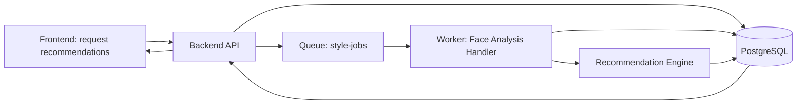

# Face Analysis and Intelligent Recommendation - Technical Spec (V1)

## 1. Purpose

Define a production-ready V1 for accurate face analysis and intelligent style recommendations that fits the existing HowDoILook architecture:

- frontend (Vue SPA)
- backend (ASP.NET Core API)
- worker (.NET 8 BackgroundService)
- shared data/contracts in data
- async queue-driven processing

This spec focuses on analysis and recommendation only. It does not replace the existing style generation pipeline.

## 2. Goals and Non-Goals

### Goals

- Produce stable, explainable face-analysis features from user photos.
- Generate ranked style recommendations with confidence and short rationale.
- Keep analysis async and resilient using the current backend -> queue -> worker pattern.
- Keep beard recommendations optional and only applicable when gender is male.
- Capture feedback signals to improve recommendation quality over time.

### Non-Goals

- Identity recognition or identity verification.
- Inference of sensitive traits.
- Full ML training pipeline in V1.
- Replacing Replicate generation models in V1.

## 3. V1 Scope

### In Scope

- Image quality gate (blur, exposure, pose, occlusion, min resolution).
- Face landmarks and geometry features.
- Region segmentation-derived features (hairline/forehead/jaw/beard coverage where applicable).
- Rule-based + weighted ranking recommender.
- Recommendation explanation strings for UI trust.
- Recommendation feedback capture.

### Out of Scope (V1)

- Personalized model fine-tuning.
- Real-time on-device inference in frontend.
- Multi-face support (reject if more than one face).

## 4. High-Level Architecture



### Architecture Notes

- Reuse existing queue and worker with a new jobType for analysis.
- Keep request/queue contracts in data and shared by backend and worker.
- Do not block API request on heavy analysis.

## 5. Pipeline Design

## 5.1 Stages

1. Validate input image URL accessibility and ownership.
2. Run quality gate.
3. Detect face and enforce exactly one face.
4. Extract landmarks and normalized geometry features.
5. Run region segmentation and derive region metrics.
6. Build analysis feature vector and confidence metrics.
7. Rank recommendation candidates with reasons.
8. Persist result and emit completion status.

## 5.2 Quality Gate Rules (Initial)

- Min image size: 768x768
- Max yaw/pitch threshold: configurable
- Blur threshold: configurable Laplacian variance
- Exposure threshold: configurable histogram bounds
- Face occlusion confidence: configurable minimum

If failed, mark analysis job failed with actionable user-facing retry message.

## 6. Data Contracts and DTOs

All contracts below are additive and versioned.

## 6.1 API DTOs (backend + frontend types)

### CreateRecommendationsRequest

```json
{
  "imageUrl": "https://...",
  "gender": "none | male | female",
  "preferences": {
    "maintenanceLevel": "low | medium | high",
    "styleVibe": "professional | casual | trendy",
    "allowHairColorChange": true,
    "allowBeardSuggestions": true
  }
}
```

### CreateRecommendationsResponse (202)

```json
{
  "analysisJobId": "uuid",
  "status": "Queued",
  "statusEndpoint": "/api/recommendations/jobs/{analysisJobId}"
}
```

### RecommendationJobStatusResponse

```json
{
  "analysisJobId": "uuid",
  "status": "Queued | Processing | Succeeded | Failed",
  "qualityGate": {
    "passed": true,
    "failureCode": "string | null",
    "message": "string | null"
  },
  "analysisSummary": {
    "faceShapeDistribution": {
      "oval": 0.1,
      "round": 0.2,
      "square": 0.6,
      "oblong": 0.1
    },
    "confidence": 0.87
  },
  "recommendations": [
    {
      "styleId": "string",
      "styleName": "string",
      "score": 0.92,
      "reasons": [
        "Balances jaw width",
        "Fits medium maintenance preference"
      ],
      "constraints": [
        "Requires moderate top volume"
      ]
    }
  ],
  "errorCode": "string | null",
  "errorMessage": "string | null"
}
```

### SubmitRecommendationFeedbackRequest

```json
{
  "analysisJobId": "uuid",
  "selectedStyleId": "string | null",
  "rating": 1,
  "feedbackTags": ["tooBold", "notMyStyle"],
  "comment": "string | null"
}
```

## 6.2 Queue Contract Extension (data/Queue)

Extend existing style-jobs message schema to support analysis jobs.

```json
{
  "jobId": "uuid",
  "jobType": "StyleGeneration | FaceAnalysis",
  "schemaVersion": 2,
  "imageUrl": "string",
  "gender": "string | null",
  "preferencesJson": "string | null"
}
```

Notes:
- Existing style generation fields remain for backward compatibility.
- Worker routes by jobType.

## 7. Database Changes (EF Core)

Additive schema only.

## 7.1 New Table: face_analysis_jobs

- id (uuid, pk)
- user_id (varchar128, indexed)
- image_url (varchar2048)
- gender (varchar50, nullable)
- preferences_json (jsonb, nullable)
- status (varchar50, indexed) // Queued, Processing, Succeeded, Failed
- quality_passed (bool, nullable)
- quality_failure_code (varchar100, nullable)
- quality_message (varchar1000, nullable)
- feature_vector_json (jsonb, nullable)
- analysis_confidence (double precision, nullable)
- recommendations_json (jsonb, nullable)
- error_code (varchar100, nullable)
- error_message (varchar2000, nullable)
- created_at_utc (timestamptz)
- started_at_utc (timestamptz, nullable)
- completed_at_utc (timestamptz, nullable)

## 7.2 New Table: recommendation_feedback

- id (uuid, pk)
- analysis_job_id (uuid, fk -> face_analysis_jobs.id, cascade delete)
- user_id (varchar128, indexed)
- selected_style_id (varchar100, nullable)
- rating (int, nullable)
- feedback_tags_json (jsonb, nullable)
- comment (varchar1000, nullable)
- created_at_utc (timestamptz)

## 7.3 Optional Future Table (Not Required for V1)

- style_catalog for central management of style metadata and constraints.

## 8. Backend API Endpoints

Add endpoints under /api/recommendations.

1. POST /api/recommendations
- Auth required.
- Creates face_analysis_jobs row with status Queued.
- Enqueues FaceAnalysis job message.
- Returns 202 Accepted.

2. GET /api/recommendations/jobs/{id}
- Auth required.
- Returns analysis status and recommendations payload.

3. POST /api/recommendations/feedback
- Auth required.
- Stores recommendation feedback for learning loop.

## 9. Worker Design

Add new handler in worker/Handlers.

## 9.1 Handler Responsibilities

- Deserialize FaceAnalysis job.
- Run stage pipeline with per-stage timing and structured logs.
- Persist intermediate and final status updates.
- Fail fast on invalid images with clear retry guidance.

## 9.2 Stage Error Codes

- ANALYSIS_IMAGE_UNREACHABLE
- ANALYSIS_MULTI_FACE_NOT_SUPPORTED
- ANALYSIS_NO_FACE_DETECTED
- ANALYSIS_QUALITY_TOO_LOW_RESOLUTION
- ANALYSIS_QUALITY_TOO_BLURRY
- ANALYSIS_QUALITY_BAD_EXPOSURE
- ANALYSIS_POOR_POSE
- ANALYSIS_SEGMENTATION_FAILED
- ANALYSIS_INTERNAL_ERROR

## 9.3 Recommendation Engine (V1)

Hybrid scoring approach:

- Rule score from style constraints and geometric heuristics.
- Preference score from maintenance/styleVibe inputs.
- Confidence penalty when analysis confidence is low.

Final score = 0.6 * ruleScore + 0.3 * preferenceScore + 0.1 * confidenceScore

Keep top 5 recommendations with explanation reasons.

## 10. Frontend Changes

Add recommendation flow in frontend/src:

- api/recommendationsApi.ts
- types/recommendations.ts
- stores/recommendations.ts
- pages/RecommendationsPage.vue

UX requirements:

- Reuse upload flow and job polling pattern.
- Show quality gate failures with specific retake guidance.
- Display ranked recommendations with reasons and confidence indicator.
- Allow user feedback submission after selection.

## 11. Security and Privacy

- Require authenticated user for recommendation endpoints.
- Do not infer or persist sensitive attributes.
- Avoid storing raw model outputs that are not required for product behavior.
- Keep feature vectors and recommendations scoped to owner userId.
- Keep secrets in environment variables only; no secrets in source.

## 12. Observability and Metrics

Emit metrics per stage:

- analysis_jobs_total
- analysis_success_rate
- quality_gate_fail_rate by failureCode
- recommendation_click_through_rate
- recommendation_feedback_rate
- recommendation_average_rating

Log with correlationId and jobId across backend and worker.

## 13. Rollout Plan

1. Add shared contracts and DB migration.
2. Implement backend endpoints and queue publish.
3. Implement worker FaceAnalysis handler and recommendation engine.
4. Implement frontend recommendations page and polling.
5. Update docs/api-contracts.md with new endpoints and schemas.
6. Add tests across backend, worker, and frontend store logic.
7. Enable with feature flag: Features:RecommendationsV1.

## 14. Testing Strategy

Backend tests:
- request validation and auth behavior
- status endpoint ownership checks
- feedback persistence validation

Worker tests:
- quality gate pass/fail transitions
- single-face constraint
- deterministic ranking output for fixed feature vectors

Frontend tests:
- polling lifecycle and terminal states
- quality failure message rendering
- recommendation selection and feedback submission

Validation commands:

- dotnet test ai-style-app/tests/AiStyleApp.Tests/AiStyleApp.Tests.csproj
- cd ai-style-app/frontend && npm test
- cd ai-style-app/backend && dotnet build
- cd ai-style-app/worker && dotnet build

## 15. Acceptance Criteria (V1)

- Recommendation request returns 202 and creates async job.
- Worker completes analysis and returns top recommendations for valid single-face input.
- Poor-quality input yields user-actionable failure response.
- Feedback endpoint stores user response linked to analysis job.
- No regression to existing style-generation flow.
- Contracts are documented in docs/api-contracts.md before merge.
