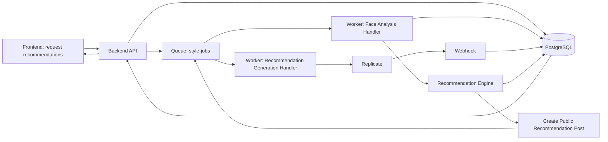
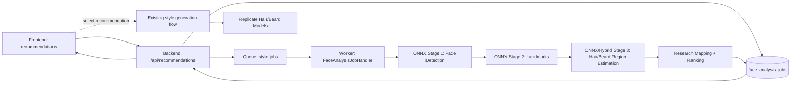

# Face Analysis and Intelligent Recommendation - Technical Spec (V1)

## 1. Purpose

Define a production-ready V1 for accurate face analysis and intelligent style recommendations that fits the existing HowDoILook architecture:

- frontend (Vue SPA)
- backend (ASP.NET Core API)
- worker (.NET 10 BackgroundService)
- shared data/contracts in data
- async queue-driven processing

This spec defines the primary product flow: upload -> analyze -> publish post -> generate 1 best variant based on telemetry and recommendation mapping.

Temporary exploration mode: until best-style determination quality is validated with enough data, pre-MVP runs experimentation mode at 100% traffic, generating three additional variants and collecting feedback on the generated styles.

Implementation status:

- The recommendations API, feedback persistence, queue publishing, and worker handler are implemented.
- ONNX landmark extraction is supported and can be enabled via worker configuration with `fan2_68_landmark.onnx`.
- Invalid ONNX landmark model files now fail fast with explicit analysis error codes.

## 2. Goals and Non-Goals

### Goals

- Produce stable, explainable face-analysis features from user photos.
- Generate one best style recommendation with confidence and short rationale.
- Publish the recommendation post first, then progressively populate generated variant results.
- Generate one best variant through Replicate as the primary visual result.
- Run a three-variant experimentation mode for 100% of pre-MVP sessions to collect ranking data.
- Keep analysis async and resilient using the current backend -> queue -> worker pattern.
- Keep beard recommendations optional and only applicable when gender is male.
- Capture feedback signals to improve recommendation quality over time.

### Non-Goals

- Identity recognition or identity verification.
- Inference of sensitive traits.
- Full ML training pipeline in V1.
- Replacing Replicate generation models in V1.

## 3. V1 Scope

### In Scope

- Image quality gate (blur, exposure, pose, occlusion, min resolution).
- Face landmarks and geometry features.
- Region segmentation-derived features (hairline/forehead/jaw/beard coverage where applicable).
- Rule-based + weighted ranking recommender.
- Recommendation explanation strings for UI trust.
- Recommendation feedback capture.

### Out of Scope (V1)

- Personalized model fine-tuning.
- Real-time on-device inference in frontend.
- Multi-face support (reject if more than one face).

## 4. High-Level Architecture



### Architecture Notes

- Reuse existing queue and worker with a new jobType for analysis.
- Keep request/queue contracts in data and shared by backend and worker.
- Do not block API request on heavy analysis.

## 5. Pipeline Design

## 5.1 Stages

1. Validate input image URL accessibility and ownership.
2. Run quality gate.
3. Detect face and enforce exactly one face.
4. Extract landmarks and normalized geometry features.
5. Run region segmentation and derive region metrics.
6. Build analysis feature vector and confidence metrics.
7. Rank recommendation candidates with reasons and select one best recommendation.
8. Create public recommendation post with the best recommendation as primary.
9. Enqueue one best-variant generation job.
10. Persist generation progress/results and emit completion status.

Experimental mode extension (pre-MVP default):

11. Enqueue three variant generation jobs for feedback collection.
12. Persist feedback and learning metrics.

## 5.2 Quality Gate Rules (Initial)

- Min image size: 768x768
- Max yaw/pitch threshold: configurable
- Blur threshold: configurable Laplacian variance
- Exposure threshold: configurable histogram bounds
- Face occlusion confidence: configurable minimum

If failed, mark analysis job failed with actionable user-facing retry message.

## 6. Data Contracts and DTOs

All contracts below are additive and versioned.

## 6.1 API DTOs (backend + frontend types)

### CreateRecommendationsRequest

```json
{
  "imageUrl": "https://...",
  "gender": "none | male | female",
  "preferences": {
    "maintenanceLevel": "low | medium | high",
    "styleVibe": "professional | casual | trendy",
    "allowHairColorChange": true,
    "allowBeardSuggestions": true
  }
}
```

### CreateRecommendationsResponse (202)

```json
{
  "analysisJobId": "uuid",
  "recommendationPostId": "uuid",
  "status": "Queued",
  "statusEndpoint": "/api/recommendations/jobs/{analysisJobId}",
  "publicEndpoint": "/api/style/{recommendationPostId}"
}
```

### RecommendationJobStatusResponse

```json
{
  "analysisJobId": "uuid",
  "recommendationPostId": "uuid",
  "publishStatus": "Published",
  "status": "Queued | Processing | Succeeded | Failed",
  "qualityGate": {
    "passed": true,
    "failureCode": "string | null",
    "message": "string | null"
  },
  "analysisSummary": {
    "faceShape": "Square",
    "confidence": 0.87
  },
  "bestRecommendation": {
    "styleId": "string",
    "styleName": "string",
    "score": 0.92,
    "reasons": [
      "Balances jaw width",
      "Fits medium maintenance preference"
    ],
    "constraints": [
      "Requires moderate top volume"
    ]
  },
  "bestVariant": {
    "generationJobId": "uuid",
    "status": "Queued | Processing | Succeeded | Failed",
    "resultImageUrl": "string | null"
  },
  "experimentalVariants": [
    {
      "slot": 1,
      "generationJobId": "uuid",
      "status": "Queued | Processing | Succeeded | Failed",
      "resultImageUrl": "string | null",
      "selectedRank": "1 | 2 | 3 | null"
    }
  ],
  "recommendations": [
    {
      "styleId": "string",
      "styleName": "string",
      "score": 0.92,
      "reasons": [
        "Balances jaw width",
        "Fits medium maintenance preference"
      ],
      "constraints": [
        "Requires moderate top volume"
      ]
    }
  ],
  "experiment": {
    "enabled": true,
    "trafficPercent": 100,
    "applied": true,
    "bucketKey": "userId-hash"
  },
  "debugTelemetry": {
    "source": "worker-v1-staged-analysis",
    "schemaVersion": 2,
    "stages": [
      {
        "stage": "landmarks",
        "notes": "square"
      }
    ]
  },
  "errorCode": "string | null",
  "errorMessage": "string | null"
}
```

Current implementation note:

- The worker persists canonical face shape in `face_analysis_jobs.feature_vector_json.faceShape` (for example, `"Square"`).
- The status API exposes face shape via `debugTelemetry.stages[]` by reading the `landmarks` stage `notes` value (lowercase label such as `"square"`).
- `analysisSummary.faceShape` is the canonical shape label for recommendation and posting decisions.

### SubmitRecommendationFeedbackRequest

```json
{
  "analysisJobId": "uuid",
  "selectedStyleId": "string | null",
  "rating": 5,
  "feedbackTags": ["greatMatch", "tooBold"],
  "comment": "string | null"
}
```

## 6.2 Queue Contract Extension (data/Queue)

Extend existing style-jobs message schema to support analysis jobs.

```json
{
  "jobId": "uuid",
  "jobType": "FaceAnalysis | RecommendationGeneration",
  "schemaVersion": 2,
  "imageUrl": "string",
  "gender": "string | null",
  "preferencesJson": "string | null"
}
```

Notes:
- Existing style-generation-first behavior is deprecated for this direction.
- Worker routes by jobType.

## 7. Database Changes (EF Core)

Additive schema only.

## 7.1 New Table: face_analysis_jobs

- id (uuid, pk)
- user_id (varchar128, indexed)
- image_url (varchar2048)
- gender (varchar50, nullable)
- preferences_json (jsonb, nullable)
- status (varchar50, indexed) // Queued, Processing, Succeeded, Failed
- quality_passed (bool, nullable)
- quality_failure_code (varchar100, nullable)
- quality_message (varchar1000, nullable)
- feature_vector_json (jsonb, nullable)
- analysis_confidence (double precision, nullable)
- recommendations_json (jsonb, nullable)
- error_code (varchar100, nullable)
- error_message (varchar2000, nullable)
- created_at_utc (timestamptz)
- started_at_utc (timestamptz, nullable)
- completed_at_utc (timestamptz, nullable)

## 7.2 New Table: recommendation_feedback

- id (uuid, pk)
- analysis_job_id (uuid, fk -> face_analysis_jobs.id, cascade delete)
- user_id (varchar128, indexed)
- selected_style_id (varchar100, nullable)
- rating (int, nullable)
- feedback_tags_json (jsonb, nullable)
- comment (varchar1000, nullable)
- created_at_utc (timestamptz)

## 7.3 Optional Future Table (Not Required for V1)

- style_catalog for central management of style metadata and constraints.

## 8. Backend API Endpoints

Add endpoints under /api/recommendations.

1. POST /api/recommendations
- Auth required.
- Creates face_analysis_jobs row with status Queued and creates recommendation post in Published state.
- Enqueues FaceAnalysis job message.
- Returns 202 Accepted.

2. GET /api/recommendations/jobs/{id}
- Auth required.
- Returns analysis status and recommendations payload.

3. POST /api/recommendations/feedback
- Auth required.
- Stores feedback for the selected recommendation and rating for learning loop.

## 9. Worker Design

Add new handler in worker/Handlers.

## 9.1 Handler Responsibilities

- Deserialize FaceAnalysis job.
- Run stage pipeline with per-stage timing and structured logs.
- Persist intermediate and final status updates.
- Fail fast on invalid images with clear retry guidance.

## 9.2 Stage Error Codes

- ANALYSIS_IMAGE_UNREACHABLE
- ANALYSIS_MULTI_FACE_NOT_SUPPORTED
- ANALYSIS_NO_FACE_DETECTED
- ANALYSIS_QUALITY_TOO_LOW_RESOLUTION
- ANALYSIS_QUALITY_TOO_BLURRY
- ANALYSIS_QUALITY_BAD_EXPOSURE
- ANALYSIS_POOR_POSE
- ANALYSIS_SEGMENTATION_FAILED
- ANALYSIS_INTERNAL_ERROR

## 9.3 Recommendation Engine (V1)

Use a deterministic hybrid scorer to select one best look bundle:

- Hair style
- Hair color
- Beard style (optional)
- Beard color (optional)

Each candidate bundle is scored using telemetry + user preferences + rule constraints.

### 9.3.1 Candidate Catalog Contract

Each candidate in the style catalog should include:

- candidateId
- hairStyleId
- supportedFaceShapes (with compatibility score per shape)
- minHairDensity and maxHairDensity
- maintenanceLevel (low, medium, high)
- supportedVibes (professional, casual, trendy)
- beardAllowed (true or false)
- beardStyleId (or NoChange)
- defaultHairColorStrategy (NoChange, natural, contrast)
- defaultBeardColorStrategy (NoChange, matchHair, natural)

### 9.3.2 Hard Constraints (Fail Candidate)

A candidate is invalid when any of the following are true:

- qualityGate.passed is false
- faceCount is not exactly 1
- gender is not male and beardStyleId is not NoChange
- allowBeardSuggestions is false and beardStyleId is not NoChange
- hairDensityEstimate is outside candidate min and max bounds
- analysisConfidence is below minimum threshold (default 0.65)

Invalid candidates are excluded before weighted ranking.

### 9.3.3 Normalized Inputs (0 to 1)

Normalize the following for scoring:

- faceShapeFit: catalog compatibility for detected face shape
- geometryFit: jaw, forehead, elongation, symmetry fit against candidate profile
- hairDensityFit: closeness to candidate density range
- beardDensityFit: closeness to candidate beard profile (male only)
- preferenceFit: maintenance and styleVibe alignment
- colorFit: hair and beard color compatibility to skin tone and natural contrast
- confidenceFit: analysisConfidence after quality adjustment

### 9.3.4 Weighted Candidate Score

Base score:

scoreBase(c) =
0.35 * faceShapeFit(c) +
0.20 * geometryFit(c) +
0.15 * preferenceFit(c) +
0.10 * hairDensityFit(c) +
0.10 * colorFit(c) +
0.10 * beardDensityFit(c)

For non-male or beard-disabled flows, set beardDensityFit(c) to 0 and re-normalize by dividing by 0.90.

Quality and confidence attenuation:

qualityFactor = clamp(0.70, 1.00, qualityConfidence)
confidenceFactor = clamp(0.60, 1.00, analysisConfidence)

finalScore(c) = scoreBase(c) * qualityFactor * confidenceFactor

### 9.3.5 Best Look Selection

- Rank valid candidates by finalScore descending.
- Select top candidate as bestRecommendation.
- Generate explanation reasons from top 2 to 3 contributing components.
- Persist contribution breakdown for audit and tuning.

Example reason mapping:

- High faceShapeFit and geometryFit -> "Balances jaw width and forehead ratio"
- High preferenceFit -> "Matches your requested maintenance level"
- High colorFit -> "Color choice preserves natural contrast"

### 9.3.6 Color and Beard Resolution Rules

After top candidate is selected:

- Hair color:
  - If allowHairColorChange is false, use NoChange
  - Else apply candidate defaultHairColorStrategy
- Beard:
  - If gender is not male, beardStyle is NoChange and beardColor is NoChange
  - If allowBeardSuggestions is false, beardStyle is NoChange and beardColor is NoChange
  - Else apply candidate beard style and defaultBeardColorStrategy

### 9.3.7 Fallback Behavior

If no candidate survives constraints:

- Return ANALYSIS_LOW_CONFIDENCE_FOR_BEST_SELECTION
- Use safe fallback bundle:
  - conservative hair style
  - hair color NoChange
  - beard NoChange
- Mark recommendation as low-confidence in status payload

### 9.3.8 Experimentation Mode (Pre-MVP Default: 100% Traffic)

For pre-MVP recommendation sessions:

- Select top 3 candidates from the same scorer
- Apply diversity filter so variants are not near-duplicates
- Keep bestRecommendation and bestVariant unchanged as canonical output
- Treat feedback on generated variants as training signals for future model tuning

### 9.3.9 Experimentation Feature Flag Contract

Use these configuration keys to control experimentation behavior:

- `Features:ExperimentationModeEnabled` (bool)
- `Features:ExperimentationTrafficPercent` (int 0 to 100)

Pre-MVP required values:

- `Features:ExperimentationModeEnabled = true`
- `Features:ExperimentationTrafficPercent = 100`

Application rule:

- Experimentation is applied when mode is enabled and user bucket hash is less than traffic percent.
- With pre-MVP values, experimentation is applied to all sessions.

Post-MVP target progression:

1. `ExperimentationModeEnabled = true`, `ExperimentationTrafficPercent = 20`
2. `ExperimentationModeEnabled = true`, `ExperimentationTrafficPercent = 5`
3. `ExperimentationModeEnabled = false`, `ExperimentationTrafficPercent = 0`

## 10. Frontend Changes

Add recommendation flow in frontend/src:

- api/recommendationsApi.ts
- types/recommendations.ts
- stores/recommendations.ts
- pages/RecommendationsPage.vue

UX requirements:

- Reuse upload flow and job polling pattern.
- Show quality gate failures with specific retake guidance.
- Display the best recommendation and best generated variant with reasons and confidence indicator.
- Pre-MVP, display three variants and allow ranking submission as 1, 2, and 3 for all recommendation sessions.

## 11. Security and Privacy

- Require authenticated user for recommendation endpoints.
- Do not infer or persist sensitive attributes.
- Avoid storing raw model outputs that are not required for product behavior.
- Keep feature vectors and recommendations scoped to owner userId.
- Keep secrets in environment variables only; no secrets in source.

## 12. Observability and Metrics

Emit metrics per stage:

- analysis_jobs_total
- analysis_success_rate
- quality_gate_fail_rate by failureCode
- recommendation_best_variant_success_rate
- recommendation_best_variant_selection_confidence
- recommendation_experiment_ranking_submission_rate

Log with correlationId and jobId across backend and worker.

## 13. Rollout Plan

1. Add shared contracts and DB migration.
2. Implement backend endpoints and queue publish.
3. Implement worker FaceAnalysis handler and recommendation engine.
4. Implement frontend recommendations page and polling.
5. Update docs/api-contracts.md with new endpoints and schemas.
6. Add tests across backend, worker, and frontend store logic.
7. Enable with feature flag: Features:RecommendationsV1.

## 14. Testing Strategy

Backend tests:
- request validation and auth behavior
- status endpoint ownership checks
- feedback persistence validation

Worker tests:
- quality gate pass/fail transitions
- single-face constraint
- deterministic ranking output for fixed feature vectors

Frontend tests:
- polling lifecycle and terminal states
- quality failure message rendering
- recommendation selection and feedback submission

Validation commands:

- dotnet test ai-style-app/tests/AiStyleApp.Tests/AiStyleApp.Tests.csproj
- cd ai-style-app/frontend && npm test
- cd ai-style-app/backend && dotnet build
- cd ai-style-app/worker && dotnet build

## 15. Acceptance Criteria (V1)

- Recommendation request returns 202 and creates async job.
- Worker completes analysis and returns top recommendations for valid single-face input.
- Poor-quality input yields user-actionable failure response.
- Best recommendation is exposed as the primary recommendation for public post views.
- One best generated variant is created and shown on the public post.
- Ranking endpoint stores 1/2/3 user response linked to analysis and experimental generation jobs for all pre-MVP recommendation sessions.
- Contracts are documented in docs/api-contracts.md before merge.

## 16. V2 Plan: ONNX Face Telemetry + Replicate Style Generation

The V2 title keeps naming continuity with existing docs, but the product flow remains recommendation-first with publish-first behavior.

V1 validated async flow and recommendation plumbing. V2 makes recommendations image-driven by adding true face-aware ONNX inference and strengthens recommendation-to-generation quality.

### 16.1 V2 Objectives

- Detect and analyze the person (face ROI), not only full-image pixel heuristics.
- Produce stable, comparable telemetry for research mapping.
- Keep Replicate models as the generation engine for haircut/beard output.
- Decouple analysis and recommendation ranking from image generation model prompts.

Current note:

- The worker already performs ONNX landmark extraction in development, so the remaining V2 work is about making the telemetry and ranking fully research-grade rather than adding the first ONNX pass.

### 16.2 V2 Non-Goals

- Replacing Replicate haircut/beard generation with ONNX in V2.
- Training custom foundation models in V2.

## 17. V2 Pipeline Architecture



### 17.1 Key Principle

Analysis and ranking become model-driven and explainable. Generation remains in current Replicate flow until a future decision changes it.

## 18. Telemetry Contract (Schema v3)

V2 introduces a strict, versioned telemetry payload inside `feature_vector_json`.

### 18.1 Required Fields

```json
{
  "source": "worker-v2-onnx-analysis",
  "schemaVersion": 3,
  "imageInfo": {
    "width": 1536,
    "height": 2048
  },
  "faceDetection": {
    "faceCount": 1,
    "primaryFace": {
      "x": 420,
      "y": 280,
      "width": 620,
      "height": 760,
      "confidence": 0.97
    }
  },
  "stageTelemetry": [
    {
      "stage": "face-detection",
      "model": "<detector-model>",
      "modelVersion": "v1",
      "durationMs": 6.3,
      "metrics": {
        "faceCount": 1,
        "primaryFaceConfidence": 0.97
      }
    },
    {
      "stage": "landmarks",
      "model": "<landmark-model>",
      "modelVersion": "v1",
      "durationMs": 4.1,
      "metrics": {
        "landmarkConfidence": 0.94,
        "yaw": 0.03,
        "pitch": -0.02
      }
    },
    {
      "stage": "region-estimation",
      "model": "<region-model-or-hybrid>",
      "modelVersion": "v1",
      "durationMs": 3.8,
      "metrics": {
        "hairDensityEstimate": 0.63,
        "beardDensityEstimate": 0.41
      }
    }
  ],
  "quality": {},
  "landmarks": {},
  "segmentation": {}
}
```

### 18.2 Telemetry Reliability Rules

- If `faceCount != 1`, mark job failed with explicit code.
- If face confidence < configured threshold, mark failed.
- If landmark confidence < configured threshold, mark failed.
- Always include model name/version per stage to track drift.

## 19. Stage Contracts (Worker)

Define stage interfaces as swappable implementations:

- `IFaceDetectorStage` -> returns face boxes + confidence.
- `IFaceLandmarkModelStage` -> returns normalized landmarks + confidence.
- `IFaceRegionEstimationStage` -> returns hair/beard region metrics.

Implementation strategy:

1. Add ONNX implementations.
2. Keep heuristic implementations behind feature flag for fallback.
3. Use DI to select implementation by config.

## 20. Research Mapping Layer

Add a dedicated mapping module that converts telemetry features into recommendation scores. This module is data-driven and independent of ONNX model runtime.

Inputs:

- face geometry features (jaw/forehead/elongation/symmetry)
- quality metrics (blur/exposure/pose)
- beard/hair estimates
- user preferences (maintenance/styleVibe/hairColor/beard opt-in)

Outputs:

- ranked haircut/beard candidates
- rationale lines linked to measured features
- recommendation confidence with contribution breakdown

## 21. Replicate Integration Constraints

Replicate stays the rendering engine for recommendation variant generation in V2.

Rules:

1. Recommendation chooses style template and parameters.
2. Recommendation ranking output queues one best-variant Replicate generation job.
3. Telemetry influences what style to generate, not how Replicate is called.
4. Hair and beard stages remain optional and compatible with current two-stage pipeline.

### 21.1 Recommendation-to-Generation Decision Contract

Use a single internal payload for the handoff between recommendation output and style generation request building.

```json
{
  "contractVersion": 1,
  "analysisJobId": "uuid",
  "userId": "string",
  "sourceImageUrl": "https://...",
  "selectedRecommendation": {
    "styleId": "textured-crop",
    "styleName": "Textured Crop",
    "score": 0.86,
    "reasons": [
      "Balances jaw width",
      "Fits medium maintenance preference"
    ]
  },
  "decision": {
    "haircut": "Textured Crop",
    "hairColor": "No change",
    "beardStyle": "No change",
    "beardColor": "No change",
    "pipelineMode": "HairOnly"
  },
  "guardrails": {
    "gender": "male | female | none",
    "allowBeardSuggestions": true,
    "qualityPassed": true,
    "analysisConfidence": 0.82,
    "minimumConfidenceRequired": 0.70
  },
  "telemetrySnapshot": {
    "source": "worker-v1-staged-analysis",
    "schemaVersion": 2,
    "landmarkConfidence": 0.78,
    "yaw": 0.12,
    "pitch": -0.03
  }
}
```

### 21.2 Contract Rules

- `analysisJobId` must refer to a `Succeeded` recommendations job owned by `userId`.
- `decision.haircut` is required; beard fields are optional.
- Beard fields must be `No change` unless `gender == male` and `allowBeardSuggestions == true`.
- If `qualityPassed == false` or `analysisConfidence < minimumConfidenceRequired`, do not enqueue style generation.
- `pipelineMode` must be one of `HairOnly`, `BeardOnly`, `HairThenBeard` and map directly to the existing style job pipeline behavior.
- This contract is reflected by public recommendation status DTOs and includes experimentation fields (pre-MVP: populated for 100% of sessions).

## 22. API and UI Additions (V2)

### 22.1 API

Extend `RecommendationJobStatusResponse` with:

- `debugTelemetry` (already present in baseline implementation)
- `faceDetection` summary (faceCount, primaryFace confidence, bbox)

### 22.2 UI

Recommendations page should display:

- image dimensions
- face detection confidence and count
- per-stage timing and model metadata
- confidence/rationale for each recommendation

## 23. Rollout and Feature Flags

Use staged rollout:

1. `Features:OnnxFaceDetection` (shadow mode)
2. `Features:OnnxLandmarks`
3. `Features:OnnxRegionEstimation`
4. `Features:RecommendationResearchMappingV2`
5. `Features:ExperimentationModeEnabled`
6. `Features:ExperimentationTrafficPercent`

`Features:OnnxFaceDetection`, `Features:OnnxLandmarks`, and `Features:OnnxRegionEstimation` are configuration-driven and may be enabled per environment as rollout progresses.

Rollout sequence:

1. Shadow mode: run ONNX and heuristic in parallel, persist both (internal only).
2. Compare telemetry stability and recommendation deltas.
3. Keep experimentation flags at pre-MVP values (`true` and `100`) while collecting ranking labels.
4. Promote ONNX output to primary when acceptance thresholds are met.
5. Ramp experimentation traffic down post-MVP using the progression in section 9.3.9.

### 23.1 Implementation Checklist (Flag Wiring)

Set the following in both backend and worker configuration.

Appsettings keys:

- `Features:ExperimentationModeEnabled`
- `Features:ExperimentationTrafficPercent`

Environment variable equivalents:

- `Features__ExperimentationModeEnabled`
- `Features__ExperimentationTrafficPercent`

Pre-MVP required values:

- `Features:ExperimentationModeEnabled = true`
- `Features:ExperimentationTrafficPercent = 100`

File-level checklist:

1. `ai-style-app/backend/appsettings.json`
  - Add `Features:ExperimentationModeEnabled`
  - Add `Features:ExperimentationTrafficPercent`
2. `ai-style-app/backend/appsettings.Development.json`
  - Override to pre-MVP values (`true`, `100`) for local development
3. `ai-style-app/worker/appsettings.json`
  - Add `Features:ExperimentationModeEnabled`
  - Add `Features:ExperimentationTrafficPercent`
4. `ai-style-app/worker/appsettings.Development.json`
  - Override to pre-MVP values (`true`, `100`) for local development
5. Deployment environment
  - Set `Features__ExperimentationModeEnabled=true`
  - Set `Features__ExperimentationTrafficPercent=100`
6. Runtime verification
  - Confirm `RecommendationJobStatusResponse.experiment.enabled=true`
  - Confirm `RecommendationJobStatusResponse.experiment.applied=true`
  - Confirm `RecommendationJobStatusResponse.experiment.trafficPercent=100`

## 24. Acceptance Criteria (V2)

- For valid portraits, face detection returns exactly one primary face with confidence >= threshold.
- Two different portraits produce meaningfully different face telemetry vectors.
- Telemetry includes non-empty stage metadata (model/version/duration/metrics).
- Recommendation ranking is traceable to telemetry features and preferences.
- Existing Replicate generation flow remains functional without contract regressions.

## 25. Open Decisions

- Final ONNX model selection for detection and landmarks (accuracy vs latency).
- Whether region estimation is ONNX segmentation or landmark-guided hybrid in V2.
- Threshold defaults for face confidence and landmark confidence by environment.

## 26. Execution Checklist (By File)

This section converts V2 into a concrete implementation sequence with minimal-risk PRs.

### PR 1: Worker Stage Interfaces + Feature Flags

Goal: introduce ONNX-ready abstractions without changing runtime behavior.

Files:

- `ai-style-app/worker/Services/FaceAnalysisPipeline.cs`
  - Add stage interfaces for detection, landmark inference, and region estimation.
  - Add telemetry object builders for face detection outputs.
- `ai-style-app/worker/Program.cs`
  - Register new interfaces in DI.
  - Add config-based implementation selection (`heuristic` vs `onnx`).
- `ai-style-app/worker/appsettings.json`
  - Add feature flags:
    - `Features:OnnxFaceDetection`
    - `Features:OnnxLandmarks`
    - `Features:OnnxRegionEstimation`
  - Add threshold settings (face confidence, landmark confidence).
- `ai-style-app/worker/appsettings.Development.json`
  - Add local defaults for feature flags and thresholds.

Exit criteria:

- No behavior change when flags are off.
- Worker build and existing face-analysis tests pass.

### PR 2: ONNX Face Detection Stage

Goal: detect primary face ROI and persist detection telemetry.

Files:

- `ai-style-app/worker/Services/FaceAnalysisPipeline.cs`
  - Invoke detector stage before quality/landmark scoring.
  - Fail with `ANALYSIS_NO_FACE_DETECTED` or `ANALYSIS_MULTI_FACE_NOT_SUPPORTED` as needed.
- `ai-style-app/worker/Services/Onnx/OnnxFaceDetectorStage.cs` (new)
  - Load ONNX detector model.
  - Return face boxes, confidence, and count.
- `ai-style-app/worker/Services/Onnx/OnnxSessionFactory.cs` (new)
  - Centralize ONNX runtime session creation and options.
- `ai-style-app/worker/Services/Onnx/OnnxImageTensorizer.cs` (new)
  - Convert ImageSharp image/ROI to model tensors.
- `ai-style-app/worker/Program.cs`
  - Register ONNX detector stage.

Exit criteria:

- Telemetry includes `faceDetection.faceCount` and `primaryFace` when successful.
- Detection failures return actionable error codes/messages.

### PR 3: ONNX Landmarks + ROI-based Quality

Goal: run landmark extraction on face ROI and shift quality checks to face-aware scoring.

Files:

- `ai-style-app/worker/Services/FaceAnalysisPipeline.cs`
  - Crop to primary face ROI for quality and landmark stages.
  - Persist yaw/pitch/landmark confidence telemetry.
- `ai-style-app/worker/Services/Onnx/OnnxFaceLandmarkStage.cs` (new)
  - Run landmark model and return normalized keypoints + confidence.
- `ai-style-app/worker/Services/HeuristicFaceQualityStage.cs` (optional split/new)
  - Keep fallback implementation while ONNX rollout is gated.

Exit criteria:

- Portrait-mode blurred background no longer dominates blur gate decisions.
- Landmark confidence present in telemetry when enabled.

### PR 4: Region Estimation (Hair/Beard)

Goal: produce stable hair/beard region metrics based on ROI or segmentation.

Files:

- `ai-style-app/worker/Services/FaceAnalysisPipeline.cs`
  - Use region stage output instead of full-frame proxies.
- `ai-style-app/worker/Services/Onnx/OnnxFaceRegionEstimationStage.cs` (new)
  - Implement ONNX segmentation or hybrid ROI algorithm.
- `ai-style-app/worker/Services/Onnx/OnnxModelOptions.cs` (new)
  - Configure model paths, execution provider, input sizes.

Exit criteria:

- Telemetry reports `hairDensityEstimate` and `beardDensityEstimate` from ROI-aware analysis.

### PR 5: Backend Telemetry Contract + Parsing Hardening

Goal: expose complete debug telemetry for validation and future research mapping.

Files:

- `ai-style-app/backend/Models/RecommendationModels.cs`
  - Add/extend DTOs for face detection summary and stage telemetry.
- `ai-style-app/backend/Services/RecommendationService.cs`
  - Parse schema v2/v3 feature vectors (case-insensitive fields).
  - Map face detection and stage telemetry to response DTOs.
- `ai-style-app/docs/api-contracts.md`
  - Document `debugTelemetry` and `faceDetection` response shape.

Exit criteria:

- API returns non-empty stage telemetry/model metadata for new jobs.

### PR 6: Frontend Debug and Operator Visibility

Goal: make telemetry auditable in UI for validation.

Files:

- `ai-style-app/frontend/src/types/api.ts`
  - Add face detection + stage telemetry client types.
- `ai-style-app/frontend/src/pages/RecommendationsPage.vue`
  - Show face count, primary face confidence, ROI dimensions, per-stage metrics.
- `ai-style-app/frontend/src/stores/recommendations.test.ts`
  - Update fixtures and assertions for telemetry presence.

Exit criteria:

- Operators can verify image-driven analysis directly from UI.

### PR 7: Research Mapping Layer

Goal: decouple recommendation scoring from hardcoded heuristic constants.

Files:

- `ai-style-app/worker/Services/RecommendationResearchMapper.cs` (new)
  - Map telemetry features to recommendation priors/weights from research table.
- `ai-style-app/worker/Services/FaceAnalysisPipeline.cs`
  - Replace inline scoring composition with mapper call.
- `ai-style-app/docs/face-analysis-recommendation-spec.md`
  - Add reference table source/versioning notes.

Exit criteria:

- Recommendation reasons include traceable feature contributions.

### PR 8: Evaluation Harness + Regression Dataset

Goal: prevent regressions and verify recommendations differ for distinct portraits.

Files:

- `ai-style-app/tests/AiStyleApp.Tests/FaceAnalysisQualityStageTests.cs`
  - Add ROI-centric cases and confidence threshold tests.
- `ai-style-app/tests/AiStyleApp.Tests/FaceAnalysisJobHandlerTests.cs`
  - Add detector failure path tests (no face, multi-face, low confidence).
- `ai-style-app/tests/AiStyleApp.Tests/RecommendationServiceTests.cs` (new)
  - Assert telemetry parsing and response mapping for schema v2/v3.
- `ai-style-app/docs/architecture.md`
  - Add evaluation metrics and rollout gates.

Exit criteria:

- Distinct portrait fixtures produce measurably distinct telemetry vectors.
- All targeted tests pass in Release.

## 27. Operational Runbook (Short)

After each PR:

1. Build and test
   - `dotnet test ai-style-app/tests/AiStyleApp.Tests/AiStyleApp.Tests.csproj -c Release`
   - `cd ai-style-app/frontend && npm test && npm run build`
2. Run backend + worker with feature flags off, then on for target stage.
3. Submit at least two different portrait images and compare telemetry in UI.
4. Confirm recommendation ranking shifts when telemetry differs.
